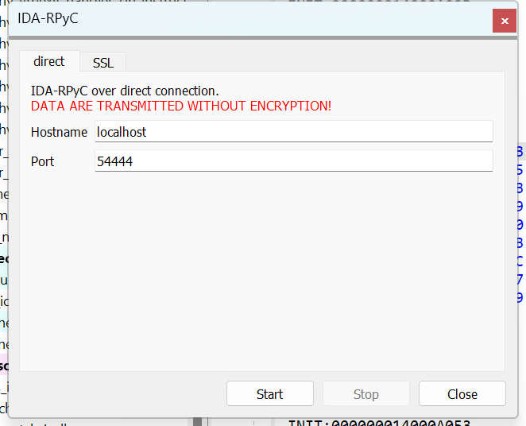
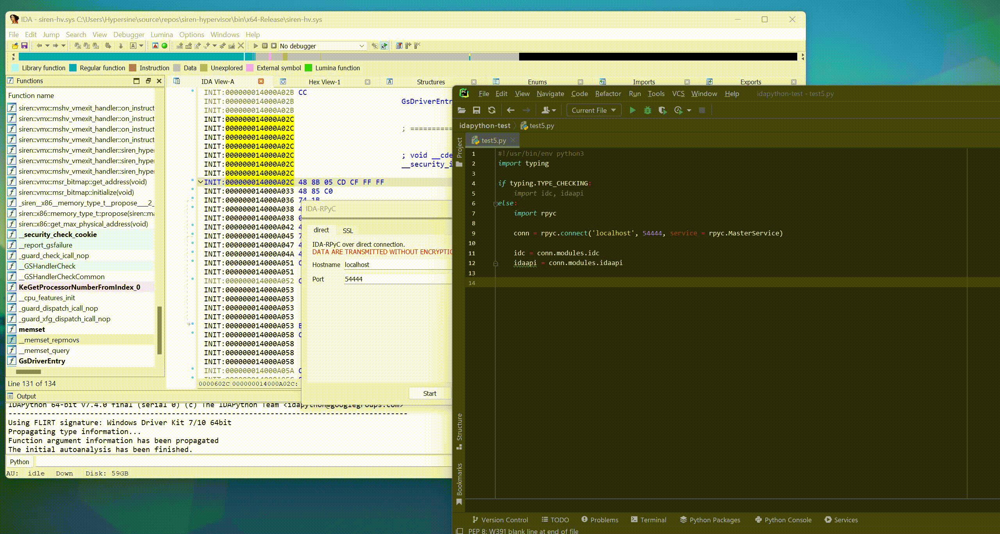

# IDA-RPyC

An IDA plugin that allows you call IDA python APIs from remote.

## 1. How to use

1. Install `rpyc`:
   
   ```shell
   $ pip install rpyc
   ```

2. Copy the script `ida-rpyc.py` to `<IDA install directory>\plugins`.

3. Open IDA. Select `Edit` -> `Plugins` -> `IDA-RPyC`. A window would pop up:
   
   

4. You can choose direct or SSL mode. Once parameters are set, you can click `Start` to start an RPyC server.

5. Now, at remote side, you can call IDA python APIs like this:

   ```py
   import rpyc

   conn = rpyc.connect('localhost', 54444, service = rpyc.MasterService)
   
   current_ea = conn.modules.idc.here()
   some_bytes = comm.modules.idaapi.get_bytes(current_ea, 4)
   print('0x{:x}: {}'.format(current_ea, some_bytes))
   ```

## 2. Useful tips

If you are writing an IDA script at remote side with the help of IDEs such as PyCharm, you may find that `conn.modules.idaapi.` doesn't trigger code autocomplete.

A solution for this would be using `typing.TYPE_CHECKING`:

```py
import typing

if typing.TYPE_CHECKING:
    import idc, idaapi
else:
    import rpyc

    conn = rpyc.connect('localhost', 54444, service = rpyc.MasterService)

    idc = conn.modules.idc
    idaapi = conn.modules.idaapi
```

When you are writing the script, only `import idc, idaapi` is visible to IDE's type checking system. So the system will collect information about classes, variables, functions and so on from the corresponding modules. Therefore, code autocomplete will come back working.

When you are running the script, such `idc`, `idaapi` modules won't be imported and will be redirected to the modules at IDA-RPyC server you connected. You need not do any further modification to your script and it will still work as you expected.

## 3. Screen recoding


